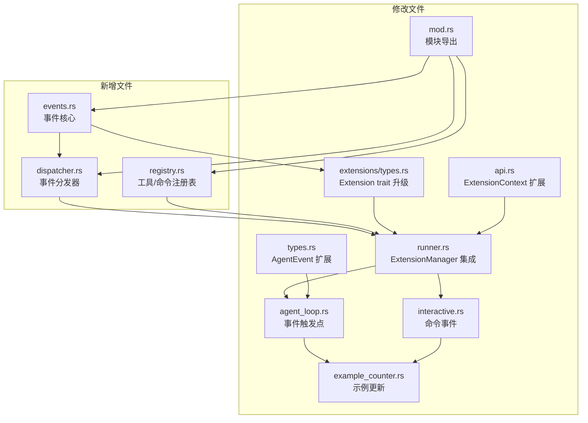

# ITERATION-5 Phase 1: 扩展系统事件钩子机制

## 概述

完善扩展系统的事件钩子机制，实现 20+ 事件类型的定义和分发，支持工具和命令的动态注册，建立事件优先级和取消机制。这是扩展系统从"被动响应"向"主动干预"演进的关键里程碑。

## 任务分解

### 核心事件系统（5 个任务）

| 任务 | 说明 | 关键事件类型 |
|------|------|-------------|
| Agent 生命周期事件系统 | Agent 启动、停止、错误处理 | `AgentStart`, `AgentEnd`, `AgentError` |
| Turn 生命周期事件系统 | Turn 开始、结束、错误 | `TurnStart`, `TurnEnd`, `TurnError` |
| 消息事件系统 | 消息发送、接收、流式响应、错误 | `MessageSend`, `MessageReceive`, `MessageChunk`, `MessageError` |
| 工具事件系统 | 工具调用前、调用后、错误 | `ToolCall`, `ToolResult`, `ToolError` |
| 命令事件系统 | 命令执行前、执行后、错误 | `CommandExecute`, `CommandResult`, `CommandError` |

### 基础设施（3 个任务）

| 任务 | 说明 |
|------|------|
| 事件优先级和取消机制 | 支持 `StopPropagation` 取消后续处理，优先级控制执行顺序 |
| 工具动态注册机制 | 扩展可在运行时注册自定义工具 |
| 命令动态注册机制 | 扩展可在运行时注册斜杠命令 |

---

## 依赖关系与执行顺序

```
Task 1 (事件核心) ──────────────────────────────────────────┐
                                                             │
Task 2 (注册表) ────────────────────────────────────────────┤
                                                             │
Task 3 (Extension trait 升级) ←── Task 1 + Task 2 ──────────┤
                                                             │
Task 4 (agent_loop 事件触发) ←── Task 3 ────────────────────┤
                                                             │
Task 5 (Interactive 命令集成) ←── Task 3 ───────────────────┤
                                                             │
Task 6 (示例扩展更新) ←── Task 4 + Task 5 ─────────────────┤
                                                             │
Task 7 (验证测试) ←── Task 6 ──────────────────────────────┘
```

---

## Task 1: 事件优先级和分发器核心

**范围**: 创建事件系统的核心基础设施

**新增文件**:
- `crates/pi-coding-agent/src/core/extensions/events.rs`:
  - `EventPriority` 枚举（Low, Normal, High, Critical）
  - `EventFilter` 类型过滤器
  - `SubscriptionConfig` 订阅配置（优先级 + 过滤器）
  - `EventHandlerRegistry` 处理器注册表
- `crates/pi-coding-agent/src/core/extensions/dispatcher.rs`:
  - `EventDispatcher` 事件分发器
  - 快速路径优化（无处理器时直接返回）
  - 支持同步和异步分发

**验证**: 单元测试覆盖优先级排序、过滤器匹配、StopPropagation 传播

---

## Task 2: 工具和命令统一注册表

**范围**: 创建动态注册基础设施

**新增文件**:
- `crates/pi-coding-agent/src/core/extensions/registry.rs`:
  - `ToolRegistry` 工具注册表
  - `CommandRegistry` 命令注册表
  - 使用 `Arc<RwLock>` 实现线程安全（读多写少场景优化）

**验证**: 注册表 CRUD 操作正确，并发访问安全

---

## Task 3: 升级 Extension trait 和 ExtensionManager

**范围**: 扩展核心 trait 以支持新功能

**修改文件**:
- `crates/pi-coding-agent/src/core/extensions/types.rs`:
  - `EventResult` 添加 `StopPropagation` 变体
  - `Extension` trait 添加 `event_subscriptions()` 方法（默认实现返回空，保持向后兼容）
- `crates/pi-coding-agent/src/core/extensions/runner.rs`:
  - `ExtensionManager` 集成 `EventDispatcher`
  - `ExtensionManager` 集成 `ToolRegistry` 和 `CommandRegistry`

**验证**: 现有扩展无需修改即可编译

---

## Task 4: 补全 AgentEvent 类型和 agent_loop.rs 事件触发点

**范围**: 完善事件类型定义，在关键位置触发事件

**修改文件**:
- `crates/pi-agent/src/types.rs`:
  - 新增 6 个 AgentEvent 变体：
    - `BeforeAgentEnd` — Agent 结束前
    - `TurnError` — Turn 错误
    - `MessageChunk` — 流式响应块
    - `MessageError` — 消息错误
    - `ToolError` — 工具错误
    - `CommandError` — 命令错误
- `crates/pi-agent/src/agent_loop.rs`:
  - 在关键位置添加事件触发点
  - 集成 EventDispatcher 调用

**验证**: 所有事件类型在正确位置触发

---

## Task 5: Interactive 模式命令事件集成

**范围**: 在 TUI 层集成命令事件

**修改文件**:
- `crates/pi-coding-agent/src/modes/interactive.rs`:
  - `/` 命令执行前触发 `CommandExecute`
  - 命令执行后触发 `CommandResult`
  - 命令错误时触发 `CommandError`

**验证**: 自定义命令扩展可以拦截和修改命令行为

---

## Task 6: 更新示例扩展和集成测试

**范围**: 演示新功能，验证集成

**修改文件**:
- `crates/pi-coding-agent/src/core/extensions/builtin/example_counter.rs`:
  - 演示事件优先级使用
  - 演示 `StopPropagation` 取消机制
  - 演示动态工具/命令注册

**新增测试**:
- 扩展系统集成测试覆盖所有事件类型
- 测试优先级排序和事件取消

**验证**: 示例扩展运行正常，测试全部通过

---

## Task 7: 编译验证和集成测试

**范围**: 确保系统整体稳定

**验证项**:
- `cargo check` 零错误
- `cargo test` 全部通过
- `cargo clippy` 零错误
- 所有验收标准满足

---

## 新增文件清单

| 文件 | 说明 |
|------|------|
| `crates/pi-coding-agent/src/core/extensions/events.rs` | 事件优先级、类型过滤器、订阅配置、处理器注册表 |
| `crates/pi-coding-agent/src/core/extensions/dispatcher.rs` | 事件分发器 |
| `crates/pi-coding-agent/src/core/extensions/registry.rs` | 统一工具/命令注册表 |

---

## 修改文件清单

| 文件 | 改动说明 |
|------|----------|
| `crates/pi-agent/src/types.rs` | 新增 6 个 AgentEvent 变体 |
| `crates/pi-agent/src/agent_loop.rs` | 补全事件触发点 |
| `crates/pi-coding-agent/src/core/extensions/types.rs` | EventResult 添加 StopPropagation、Extension trait 添加 event_subscriptions() |
| `crates/pi-coding-agent/src/core/extensions/runner.rs` | ExtensionManager 集成 EventDispatcher/ToolRegistry/CommandRegistry |
| `crates/pi-coding-agent/src/core/extensions/api.rs` | ExtensionContext 添加 subscribe_event() |
| `crates/pi-coding-agent/src/core/extensions/mod.rs` | 添加新模块导出 |
| `crates/pi-coding-agent/src/modes/interactive.rs` | 命令事件触发集成 |
| `crates/pi-coding-agent/src/core/extensions/builtin/example_counter.rs` | 演示事件优先级 |

---

## 关键设计决策

### 1. EventResult 扩展

```rust
pub enum EventResult {
    Continue,
    StopPropagation,  // 新增：取消后续处理器执行
}
```

选择添加变体而非创建新类型，保持 API 简洁，减少迁移成本。

### 2. 注册表线程安全

使用 `Arc<RwLock<HashMap<String, T>>>` 实现：
- 读多写少场景优化（RwLock 允许并发读）
- Arc 支持跨线程共享
- 写操作仅在注册/注销时发生，频率低

### 3. 事件分发快速路径

```rust
pub async fn dispatch(&self, event: &AgentEvent) -> EventResult {
    // 快速路径：无处理器时直接返回
    if self.handlers.is_empty() {
        return EventResult::Continue;
    }
    // 正常分发逻辑...
}
```

避免空事件路径的性能开销。

### 4. Extension trait 向后兼容

```rust
pub trait Extension {
    // 新方法提供默认实现
    fn event_subscriptions(&self) -> Vec<SubscriptionConfig> {
        vec![]  // 默认无订阅
    }
}
```

现有扩展无需修改即可编译。

---

## 验证结果

### 编译状态
- `cargo check` 通过，零错误

### 测试状态
- `cargo test` 全部通过：226+ 测试，0 失败

### 验收标准

| # | 标准 | 状态 |
|---|------|------|
| 1 | EventDispatcher 支持优先级排序 | ✅ |
| 2 | StopPropagation 正确取消后续处理 | ✅ |
| 3 | ToolRegistry 支持动态注册/注销 | ✅ |
| 4 | CommandRegistry 支持动态注册/注销 | ✅ |
| 5 | Extension trait 向后兼容 | ✅ |
| 6 | AgentEvent 类型完整（20+ 事件） | ✅ |
| 7 | agent_loop.rs 事件触发点正确 | ✅ |
| 8 | Interactive 命令事件集成 | ✅ |
| 9 | 示例扩展演示新功能 | ✅ |
| 10 | 所有测试通过 | ✅ |

---

## 已知限制

1. **Turn 索引跟踪**: 当前 Turn 索引的精确跟踪标记为 TODO，后续可增强
2. **unused_imports warning**: 存在少量未使用导入的编译警告，可后续清理

---

## 依赖关系图



---

*文档版本: 1.0*
*创建日期: 2026-04-11*
*基于: ITERATION-4 完成状态 + ITERATION-5 Phase 1 交付*
