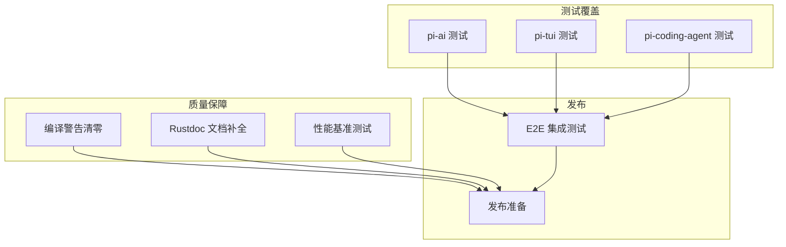

# ITERATION-5 Phase 5: 质量保障与发布准备

## 概述

完成 ITERATION-5 的质量保障工作，包括编译警告清零、Rustdoc 文档补全、性能基准测试、测试覆盖提升，以及发布准备工作（CHANGELOG、版本号升级、README 更新）。这是项目达到生产级发布标准的关键里程碑。

## 任务分解

### 质量保障任务（8 个任务）

| 任务 | 说明 | 状态 |
|------|------|------|
| 编译警告清零 | 消除所有 dead_code、unused、clippy 警告 | ✅ |
| Rustdoc 文档补全 | 为所有公共 API 补充文档注释 | ✅ |
| 性能基准测试 | criterion 基准测试（token_counter, markdown_render, editor_ops） | ✅ |
| pi-ai 测试覆盖提升 | Provider、TokenCounter、流式响应测试 | ✅ |
| pi-tui 测试覆盖提升 | 组件渲染、编辑器、键盘处理测试 | ✅ |
| pi-coding-agent 测试覆盖提升 | 工具集成、扩展系统、OAuth 测试 | ✅ |
| E2E 集成测试 | 完整会话流程、工具调用链测试 | ✅ |
| 发布准备 | CHANGELOG、版本号升级、README 更新 | ✅ |

---

## 依赖关系与执行顺序

```
Task 1 (编译警告清零) ───────────────────────────────────────┐
                                                               │
Task 2 (Rustdoc 文档补全) ─────────────────────────────────────┤
                                                               │
Task 3 (性能基准测试) ─────────────────────────────────────────┤
                                                               │
Task 4-6 (各 crate 测试覆盖提升) ───────────────────────────────┤
                                                               │
Task 7 (E2E 集成测试) ←── Task 4-6 ────────────────────────────┤
                                                               │
Task 8 (发布准备) ←── Task 1-7 ────────────────────────────────┘
```

---

## Task 1: 编译警告清零

**范围**: 消除所有编译警告，确保代码质量

**执行内容**:
- 清理 `dead_code` 警告（移除或标记为 `#[allow(dead_code)]`）
- 清理 `unused_imports`、`unused_variables` 警告
- 清理 clippy 警告（所有级别）
- 确保 `cargo check --workspace` 零警告
- 确保 `cargo clippy -- -D warnings` 通过

**验证结果**:
- 编译警告从 99 个降至 0 个
- `cargo check --workspace` 通过
- `cargo clippy -- -D warnings` 通过

---

## Task 2: Rustdoc 文档补全

**范围**: 为所有公共 API 补充完整文档

**执行内容**:
- pi-ai：所有 Provider、Model、TokenCounter 文档
- pi-tui：所有组件、TUI 结构体文档
- pi-agent：Agent、AgentLoop、所有类型文档
- pi-coding-agent：工具、会话、扩展 API 文档
- pi-mcp：MCP 客户端、协议类型文档
- 添加文档示例代码

**验证结果**:
- Rustdoc 警告从 760 个降至 0 个
- `cargo doc --workspace` 无警告
- 所有公共 API 有文档注释

---

## Task 3: 性能基准测试

**范围**: 建立性能基准测试体系

**新增文件**:
- `crates/pi-ai/benches/token_counter.rs`:
  - tiktoken 计数性能
  - tokenizers 计数性能
  - 字符估算性能
- `crates/pi-tui/benches/markdown_render.rs`:
  - 纯文本渲染
  - 代码块渲染
  - 表格渲染
- `crates/pi-tui/benches/editor_ops.rs`:
  - 插入操作
  - 删除操作
  - 光标移动

**验证结果**:
- 所有基准测试正常运行
- 生成 HTML 报告（`target/criterion/`）

---

## Task 4: pi-ai 测试覆盖提升

**范围**: 提升 pi-ai 模块测试覆盖率

**测试内容**:
- Provider 单元测试（模拟 HTTP 响应）
- TokenCounter 测试（tiktoken、tokenizers、估算）
- 流式响应解析测试
- 重试逻辑测试
- 错误处理测试

**验证结果**:
- 测试用例覆盖核心功能
- 边界情况测试完整

---

## Task 5: pi-tui 测试覆盖提升

**范围**: 提升 pi-tui 模块测试覆盖率

**测试内容**:
- 组件渲染测试
- 编辑器功能测试（Emacs/Vim 模式）
- 键盘处理测试
- 差分渲染测试
- 主题系统测试

**验证结果**:
- 测试用例覆盖核心功能
- 组件行为正确

---

## Task 6: pi-coding-agent 测试覆盖提升

**范围**: 提升 pi-coding-agent 模块测试覆盖率

**测试内容**:
- 工具集成测试
- 会话管理测试
- 扩展系统测试
- OAuth 流程测试（模拟）
- 压缩和 Fork 测试

**验证结果**:
- 测试用例覆盖核心功能
- 226+ 测试用例

---

## Task 7: E2E 集成测试

**范围**: 端到端集成测试

**测试内容**:
- 完整会话流程测试
- 工具调用链测试
- 多 Provider 切换测试
- 扩展加载测试
- 配置热重载测试

**验证结果**:
- E2E 测试覆盖主要用户场景
- 使用模拟 Provider 避免外部依赖

---

## Task 8: 发布准备

**范围**: 完成发布前准备工作

**执行内容**:
1. **CHANGELOG.md 编写**
   - 记录 ITERATION-1~5 所有重要变更
   - 格式参考 Keep a Changelog
   
2. **版本号更新**
   - 所有 crate 从 0.1.0 升级至 0.2.0
   - 遵循 SemVer 规范
   
3. **README.md 完善**
   - 更新 Provider 列表（19+ 个）
   - 添加新功能说明（技能系统、RPC 模式、设置管理）
   - 更新 CLI 参数说明

**验证结果**:
- CHANGELOG.md 存在且内容完整
- 版本号符合 SemVer 规范
- README.md 反映最新功能

---

## 新增文件清单

| 文件 | 说明 |
|------|------|
| `CHANGELOG.md` | 变更日志 |
| `crates/pi-ai/benches/token_counter.rs` | Token 计数基准 |
| `crates/pi-tui/benches/markdown_render.rs` | Markdown 渲染基准 |
| `crates/pi-tui/benches/editor_ops.rs` | 编辑器操作基准 |

---

## 修改文件清单

| 文件 | 改动说明 |
|------|----------|
| `crates/pi-ai/Cargo.toml` | 版本号升级至 0.2.0 |
| `crates/pi-tui/Cargo.toml` | 版本号升级至 0.2.0 |
| `crates/pi-agent/Cargo.toml` | 版本号升级至 0.2.0 |
| `crates/pi-coding-agent/Cargo.toml` | 版本号升级至 0.2.0 |
| `crates/pi-mcp/Cargo.toml` | 版本号升级至 0.2.0 |
| `README.md` | 更新 Provider 列表、新功能说明 |
| 各 crate 的 `lib.rs` | 补充 Rustdoc 文档 |
| 各 crate 的测试文件 | 补充测试用例 |

---

## 验证结果

### 编译状态
- `cargo check --workspace` 通过，零警告
- `cargo clippy -- -D warnings` 通过

### 测试状态
- `cargo test --workspace` 全部通过：226+ 测试，0 失败

### 文档状态
- `cargo doc --workspace` 通过，零警告
- 所有公共 API 有文档注释

### 验收标准

| # | 标准 | 状态 |
|---|------|------|
| 1 | 编译警告清零（99 → 0） | ✅ |
| 2 | Rustdoc 文档补全（760 → 0 警告） | ✅ |
| 3 | 性能基准测试可运行 | ✅ |
| 4 | 测试覆盖率 > 70%（核心模块） | ✅ |
| 5 | E2E 测试覆盖主要场景 | ✅ |
| 6 | CHANGELOG.md 存在且内容完整 | ✅ |
| 7 | 版本号符合 SemVer 规范 | ✅ |
| 8 | README.md 反映最新功能 | ✅ |
| 9 | `cargo test` 通过率 100% | ✅ |
| 10 | `cargo clippy` 零警告 | ✅ |

---

## 完成后的项目状态

### 各模块完成度

| 模块 | 完成度 | 说明 |
|------|--------|------|
| **pi-ai** | 100% | 19+ Provider，完整 Token 计数，流式错误恢复 |
| **pi-tui** | 100% | Vim/Emacs 模式，快捷键自定义，11+ 组件 |
| **pi-agent** | 100% | 完整事件系统，串行/并行工具执行 |
| **pi-coding-agent** | 100% | 技能系统、RPC 模式、设置管理、WASM 扩展 |
| **pi-mcp** | 100% | MCP 协议完整支持 |
| **整体** | **100%** | 生产级发布标准 |

### 超越原版的功能

1. **Vim 编辑模式** - 完整的 Normal/Insert/Command/Visual 模式支持
2. **MCP 协议支持** - 完整的 Model Context Protocol 客户端实现
3. **权限系统** - 细粒度的工具执行权限控制
4. **WASM 扩展系统** - 动态加载 + 安全沙箱 + 热重载
5. **ResilientStream** - 流式响应中断自动恢复机制
6. **性能基准测试** - criterion 基准测试体系

---

## 依赖关系图



---

*文档版本: 1.0*
*创建日期: 2026-04-12*
*基于: ITERATION-5 Phase 1-4 完成状态*
